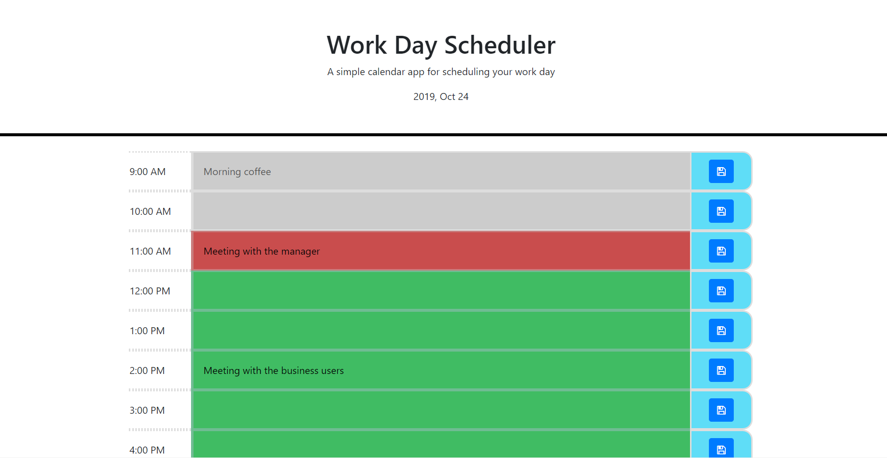

# Day-Planner

A simple day planner to keep track of your daily activities.

This is a one-page application, which contains two sections: 
* Header
* Time table

The header contains current day.

The time table consists of three columns - the time, the event and the "save" button.
The record corresponding to a current hour is displayed in red. 
All past records are displayed in gray. Also the input in those records is disabled.
All future records are displayed in green. 

The user can enter and save events for current and future hours. Events will be saved in the browser local storage.

When the new day comes, all old events are cleared from the storage. 

Link to app: 
https://volkir87.github.io/Day-Planner